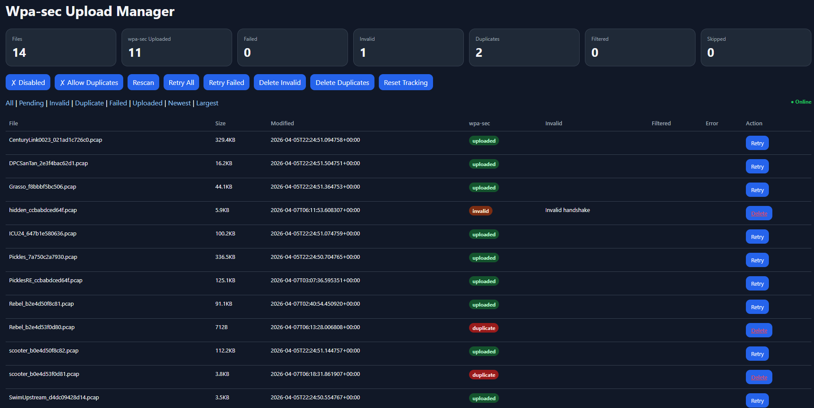

This plugin is designed to work with jayofelony Pwnagotchi 2.9.5.4

# Wpa-sec Upload Manager

Pwnagotchi plugin for managing and uploading WPA handshake captures to [wpa-sec.stanev.org](https://wpa-sec.stanev.org) with intelligent deduplication and status tracking.

## Installation

1. Copy `upload_manager.py` to your Pwnagotchi plugins directory: /usr/local/share/pwnagotchi/custom-plugins

2. Update your Pwnagotchi `config.toml`:
    ```toml
    [main.plugins.upload_manager]
    enabled = true
    handshake_dir = "/home/pi/handshakes"
    db_path = "/home/pi/handshakes/upload_state.json"
    command_dir = "/home/pi/handshakes"
    log_path = "/tmp/upload_manager.log"
    scan_recursive = true
    scan_interval = 300
    min_file_size = 512
    min_file_age = 30
    retry_backoff_seconds = 1800
    max_retries = 25
    delete_trigger_files = true
    pwncrack_api_key = "1b7bb35d-eed0-4570-b668-08a4adecc85c"
    wpa_sec_api_key = "8eb4fe22cbcb6fb2f681f0e1cc071b0a"
    whitelist = []
    ui_slot = "uploadmgr"
    prune_missing = false
    startup_rescan = true
    max_consecutive_errors = 10
    web_sort = "name"
    ```

3. Restart Pwnagotchi:
   ```bash
   sudo systemctl restart pwnagotchi
   ```

4. Access the dashboard at: `http://pwnagotchi.local:8080`

## Configuration Settings Explained

### Required
- `wpa_sec_api_key`: Your API key from wpa-sec (get yours at [https://wpa-sec.stanev.org](https://wpa-sec.stanev.org))

### Path Configuration
- `handshake_dir`: Primary handshake directory (default: `/home/pi/handshakes`)
- `extra_handshake_dirs`: Additional directories to scan (default: none)
- `db_path`: Database file path (auto-set to `handshake_dir/upload_state.json` if not specified)
- `command_dir`: Directory for temporary files (auto-set to `handshake_dir` if not specified)
- `log_path`: Log file path (default: `/tmp/upload_manager.log`)

### Upload Behavior
- `enable_wpa_sec`: Enable/disable auto-uploads to wpa-sec (default: `true`)
- `allow_duplicate_ssid_uploads`: Allow uploading same SSID multiple times (default: `false`)
- `delete_trigger_files`: Delete `.trigger` files after upload (default: `true`)

### File Filtering
- `min_file_size`: Minimum file size in bytes to upload (default: `512`)
- `min_file_age`: Minimum file age in seconds before eligible for upload (default: `30`)
- `scan_recursive`: Recursively scan subdirectories (default: `true`)
- `whitelist`: List of SSIDs to skip uploading (default: `[]`)

### Scanning & Retry
- `scan_interval`: Seconds between file scans (default: `300`) (Personally i like 60 though)
- `startup_rescan`: Scan files on plugin startup (default: `true`)
- `max_retries`: Maximum upload retry attempts per file (default: `25`)
- `retry_backoff_seconds`: Seconds to wait before retrying failed uploads (default: `1800`)
- `max_consecutive_errors`: Max errors before pausing uploads (default: `10`)

### UI & Dashboard
- `ui_slot`: Dashboard slot name (default: `uploadmgr`)
- `web_sort`: Default dashboard sort order - `"name"`, `"size"`, or `"date"` (default: `"name"`)
- `prune_missing`: Delete database entries for files no longer on disk (default: `false`)

### Performance
- `hash_block_size`: Block size for SHA1 hashing in bytes (default: `1048576` / 1MB)

## Usage

### Dashboard Button Actions

| **✓ Enabled** / **✗ Disabled** | Toggle auto-upload | "Auto uploads enabled/disabled" |
| **Dup Uploads** | Toggle duplicate SSID uploads | "Allow/prevent duplicate SSIDs from uploading" |
| **Rescan** | Scan for new files | "Scan files for new handshakes" |
| **Retry All** | Retry all failed uploads | "Retry all failed uploads" |
| **Retry Failed** | Retry only failures | "Retry only failed uploads" |
| **Delete Invalid** | Remove invalid handshakes | "Delete all invalid handshakes" |
| **Delete Duplicates** | Remove duplicate SSIDs | "Delete duplicate SSIDs" |
| **Reset Tracking** | Clear upload history (testing) | "Reset upload tracking (for testing - may cause duplicates)" |

### Filtering
- **All**: Show all files
- **Pending**: Ready for upload
- **Uploaded**: Successfully sent to wpa-sec
- **Failed**: Upload attempt failed
- **Skipped**: Missing API key
- **Filtered**: Whitelisted or non-actionable
- **Invalid**: No valid handshakes / too small / too new / pre-existing
- **Duplicate**: Same SSID (when duplicates disabled)

### Sorting
- **By Name**: Alphabetical SSID order
- **By Size**: File size order
- **By Date**: Most recent first

## How It Works

### File Monitoring
1. Scans `/home/pi/handshakes` and `/root/handshakes` for `.pcap` files
2. Calculates SHA1 hash and file metadata
3. Tracks files in JSON database: `upload_manager.db`

### Deduplication Strategy
- **SSID-Based**: Extracts SSID from filename format: `SSID_BSSID.pcap`
- **Pre-existing Detection**: Files modified before plugin installation are auto-marked as uploaded
- **User Control**: `allow_duplicate_ssid_uploads` setting controls duplicate behavior

### Upload Process
1. Validates handshake quality (file size, age, structure)
2. Checks for duplicates and skips if filtered
3. Sends POST request to wpa-sec with API key as HTTP cookie
4. Tracks response status and error messages
5. Retries failed uploads up to configured attempt limit

### Status Lifecycle
```
New File → Pending → Uploaded ✓
              ↓
           Invalid (deleted)
              ↓
            Duplicate (pre-existing or same SSID)
              ↓
             Failed (retry available)
              ↓
            Skipped (no API key)
```

## Database Schema

### Location
- `upload_manager.db` (JSON format, stored alongside plugin)

### Structure
```json
{
  "meta": {
    "version": 1,
    "created": "2024-01-15T10:30:00",
    "install_timestamp": 1705320600.123,
    "uploaded_ssids": ["Network1", "Network2"],
    "enable_wpa_sec": true,
    "allow_duplicate_ssid_uploads": false
  },
  "files": {
    "/root/handshakes/Network1_AA:BB:CC:DD:EE:FF.pcap": {
      "name": "Network1",
      "size": 45678,
      "mtime": 1705320600,
      "sha1": "abc123def456...",
      "services": {
        "wpa_sec": {
          "status": "UPLOADED",
          "attempts": 1,
          "error": null
        }
      }
    }
  }
}
```

## Status Types

| Status | Meaning | Action |
|--------|---------|--------|
| `PENDING` | Ready for upload | Will attempt upload on next scan |
| `UPLOADED` | Successfully sent to wpa-sec | No further action |
| `FAILED` | Upload failed (network error, server error) | Can retry manually |
| `SKIPPED` | Skipped (missing API key) | Configure API key and retry |
| `FILTERED` | Whitelisted or non-actionable | No action needed |
| `INVALID` | Invalid handshake (no valid handshakes, too small, too new) | Can delete or monitor |
| `DUPLICATE` | Duplicate SSID detected | Can delete or allow re-upload by toggling setting |

## Troubleshooting

### No files appearing on dashboard
- Verify handshake directory permissions: `ls -la /root/handshakes/`
- Check plugin log: `sudo tail -f /var/log/pwnagotchi.log`
- Ensure `scan_interval` has passed since last scan

### Files marked as INVALID
- File too small? Try increasing `min_file_size` in config
- File too new? Try increasing `min_file_age` in config
- Genuine invalid handshake? Verify with: `tcpdump -r filename.pcap | grep -i eapol`

### Uploads failing with API key issues
- Verify API key is correctly set in `config.toml`
- Test API key: `curl -b "api_key=YOUR_KEY" https://wpa-sec.stanev.org/?submit`
- Account may be disabled on wpa-sec

### Too many duplicate uploads
- Disable "Dup Uploads" if only want one submission per SSID
- Use "Delete Duplicates" to clean up pre-existing backlog
- Use "Reset Tracking" to clear history and rebuild

### Files not uploading despite PENDING status
- Verify internet connectivity (check online indicator)
- Check for network errors in dashboard
- Retry failed uploads manually

## Performance Notes

- Dashboard loads fast (~50ms) for typical installations (100-500 files)
- Background upload scans run at configured `scan_interval` (default 300s)
- JSON database grows ~1KB per tracked file
- Retains full history; use "Delete Invalid/Duplicates" to clean up

## API Integration

### wpa-sec Upload Format
```
POST https://wpa-sec.stanev.org/?submit
Cookie: api_key=YOUR_KEY
User-Agent: Mozilla/5.0
Content-Type: multipart/form-data

File: raw .pcap or .pcapng format
```

### Expected Responses
- `200 OK` - Upload successful
- `400 Bad Request` - Invalid handshake or file format
- `403 Forbidden` - Invalid API key
- `5xx Server Error` - Temporary server issues (will retry)

## Requirements

- **Python**: 3.6+
- **Pwnagotchi**: Latest version
- **Internet**: For wpa-sec uploads
- **wpa-sec Account**: Free at [https://wpa-sec.stanev.org](https://wpa-sec.stanev.org)

## File Structure

```
PcapManager/
├── upload_manager.py      # Main plugin (~1100 lines)
├── config.toml            # Configuration file
├── upload_manager.db      # Database (auto-generated)
└── README.md              # This file
```

## Known Limitations

- **One-way uploads only**: Downloads cracked passwords not yet implemented
- **wpa-sec only**: No support for other cracking services
- **Linux/ARM only**: Requires Pwnagotchi platform
- **Built-in plugin conflicts**: Must disable Pwnagotchi's native wpa-sec plugin if installed

## Tips & Tricks

### Pre-existing Handshake Handling
If you're installing this plugin on a Pwnagotchi with 100+ existing captures, the plugin will:
1. Record installation timestamp
2. Mark all files older than install time as `STATUS_UPLOADED`
3. Add their SSIDs to `uploaded_ssids` list
4. Prevent re-uploading them

This prevents accidental mass re-submissions to wpa-sec.

### Mass Operations
- Use **Delete Invalid** to clean up incomplete captures
- Use **Delete Duplicates** to keep only one submission per SSID
- Use **Reset Tracking** only for testing (will re-submit all files!)

## Changelog

- **v1.0** - Initial release with wpa-sec integration, SSID deduplication, pre-existing file detection, and web dashboard
